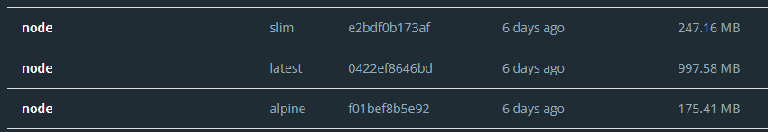

# Imagen base del contenedor

## Criterios de búsqueda de una imagen base:

Para poder completar el [M2](https://github.com/pablo1mc315/iv_pablomc/milestone/3), debemos crear un contenedor donde se ejecuten nuestros tests. Para ello, lo primero es elegir una imagen base sobre la que construir nuestro contenedor.

Siguiendo las buenas prácticas, usaremos una imagen base de Docker oficial y verificada, las cuales podemos encontrar en [dockerhub](https://hub.docker.com/search?q=&type=image&image_filter=official%2Cstore). En este caso, será la imagen base de [Node](https://hub.docker.com/_/node), pero debemos ver las distintas versiones y elegir una acorde a nuestro objetivo. Para elegir una para nuestra aplicación, se establecen los siguientes criterios:

- El tamaño de la imagen es muy importante, puesto que cuanto menos ocupe la misma, más se optimizará el rendimiento y menos tiempo tardarán los tests en ejecutarse.
- Usaremos una versión específica de la imagen de Node teniendo en cuenta que vamos a usar nuestro contenedor para testear nuestra aplicación. 
- Debe tener soporte actualmente y estar en continuo mantenimiento, puesto que no queremos que nuestra aplicación quede obsoleta.

## Imágenes base posibles:

### node:latest

Es la última versión de la imagen base de Node.

- :heavy_check_mark: Está en continuo mantenimiento ya que el último push en dockerhub fue hace apenas una semana.
- :heavy_check_mark: Tiene un montón de funcionalidades ya instaladas como `wget`,  `git` o `curl`, pero no nos son relevantes a la hora de ejecutar nuestros tests.
- :x: Esto que acabamos de mencionar hace que el tamaño de la imagen suba a 997 MB, lo cual es demasiado para el objetivo que le vamos a dar al contenedor.

## node:slim

Es la versión de la imagen base de Node más simplificada posible.

- :heavy_check_mark: Está en continuo mantenimiento ya que el último push en dockerhub fue hace apenas una semana.
- :heavy_check_mark: No contiene los paquetes comunes contenidos en la versión predeterminada y solo contiene los paquetes mínimos necesarios para ejecutar Node, ocupando 247 MB al instalarla en nuestro dispositivo.
- :x: Los propios desarrolladores sólo la recomiendan en el caso de que se tengan limitaciones de espacio, puesto que no tiene apenas funcionalidades más allá de las propias de Node.

## node:alpine

Es la versión de la imagen base de Node basada en el proyecto Alpine Linux.

- :heavy_check_mark: Está en continuo mantenimiento ya que el último push en dockerhub fue hace apenas una semana.
- :heavy_check_mark: Al estar basado en Alpine Linux, ocupa muchísimo menos espacio, además de no traer funcionalidades externas que no necesitamos ya instaladas, lo que le da un tamaño de 175 MB.

# Otras opciones

He descartado otras opciones como node:buster o node:bullseye ya que, aunque son versiones mucho menos pesadas que node:latest, ambas tienen una fecha de caducidad estimada para 2024 y 2026, respectivamente, por lo que cuando dejen de actualizarse nuestro proyecto quedaría desactualizado.

## Imagen base elegida:

Una vez descargadas las tres imágenes en mi dispositivo y viendo el peso y características de cada una, me voy a decantar por node:alpine, en concreto en su versión de soporte a largo plazo `node:lts-alpine` para así asegurar que nuestra aplicación no queda obsoleta, además de ocupar muy poco espacio al estar basada en la distribución Alpine Linux y contener las funcionalidades básicas para nuestro objetivo en el proyecto.